# Week 1: Foundations of Physical AI

## Learning Objectives

After completing this chapter, you will be able to:
- Define Physical AI and explain how it differs from traditional digital AI systems
- Understand the concept of embodied intelligence and why it matters for robotics
- Identify key differences between AI that operates in digital spaces vs. physical environments
- Recognize real-world applications where Physical AI is already transforming industries
- Articulate the technical challenges involved in bridging AI models with physical bodies

---

## 1. What is Physical AI?

Physical AI represents a fundamental paradigm shift in artificial intelligence systems. Unlike traditional AI that operates exclusively in digital domains—processing text, images, or code within computers—**Physical AI systems exist in, interact with, and understand the physical world**.

### Defining Physical AI

Physical AI (also called "Embodied AI" or "AI in the physical world") refers to AI systems that are integrated with physical hardware and must comprehend and operate according to real-world physics, dynamics, and constraints. These systems have:
- A **body** (robotic arm, humanoid, autonomous vehicle, drone)
- **sensors** to perceive the environment (cameras, LIDAR, IMUs, microphones)
- **actuators** to affect the world (motors, grippers, propellers)
- An **AI brain** that processes sensor data and controls actuators

### Why "Physical" Matters

The distinction is critical: a language model can write poetry about gravity, but a Physical AI robot must actually **balance** under gravity. A chatbot can describe how to catch a ball, but a Physical AI system must track the ball's trajectory in 3D space, predict its motion, and move its arm to intercept—all while accounting for inertia, friction, and wind.

Physical AI systems must understand:
- **Newtonian physics**: Objects obey laws of motion, conservation of momentum
- **Uncertainty**: Sensors are noisy; real environments change unpredictably
- **Time constraints**: Decisions must be made in milliseconds to avoid collisions
- **Energy limits**: Battery power and motor torque impose real constraints
- **Safety**: Mistakes have physical consequences—damaging property or harming people

### The Digital Brain in a Physical Body

Think of Physical AI as giving an AI model a body. The "brain" might be a neural network, a reinforcement learning model, or a large language model (LLM). But without a body, it's trapped in digital space. Physical AI is about **bridging** that brain to actuators that can reach, move, and manipulate reality.

---

## 2. Embodied Intelligence

Embodied intelligence is the foundational concept behind Physical AI: intelligence that emerges from an agent's ability to physically interact with its environment. This contrasts with intelligence developed solely through passive observation (like training a model on a dataset).

### From Passive to Active Learning

Traditional AI training is passive: models learn from static datasets—millions of images, billions of text documents. The AI never touches, moves, or affects what it's learning about.

Embodied intelligence is **active**: the agent explores, experiments, and learns through doing. A robot learns about cups by picking them up, feeling their weight, testing their fragility, and observing how they roll when dropped. This interactive learning creates knowledge that's fundamentally different from dataset-based learning.

### The Sensorimotor Loop

Embodied agents operate in a continuous **sensorimotor loop**:

1. **Sense**: Gather data from environment (vision, touch, proprioception)
2. **Perceive**: Process sensory input to build understanding
3. **Plan**: Decide on an action based on goals and current state
4. **Act**: Execute motor commands to affect the world
5. **Observe**: See the result of the action
6. **Update**: Learn and adjust models for next cycle

This loop runs dozens to hundreds of times per second. Each iteration refines the agent's understanding of both itself and its environment.

*Figure 1.2: The sensorimotor loop - how embodied agents continuously learn from interacting with their environment*

### Examples in Nature and Technology

**Biological embodiment**: Humans learn by interacting with the world from birth. A child learns about gravity by falling, about object permanence by playing peek-a-boo, and about social dynamics through interaction. This embodied cognition is foundational to human intelligence.

**Technological embodiment**: Boston Dynamics' Atlas humanoid, Waymo's autonomous vehicles, Tesla's Optimus robot—all demonstrate embodied intelligence. They don't just "know" about the world from training data; they actively explore, navigate, and manipulate in real-time.

### Why Embodiment Enables Generalization

Embodied agents can generalize more robustly because they develop intuition through physical interaction. A robot that learns to pick up a cup develops spatial awareness that transfers to picking up bottles, mugs, and other similarly shaped objects—even if it never trained specifically on those objects. This **sensorimotor grounding** is what Physical AI seeks to achieve.

---

## 3. Digital AI vs. Physical AI

Understanding the distinction between digital and physical AI is crucial for grasping the challenges and opportunities in the Physical AI field.

### Key Differences

| Aspect | Digital AI | Physical AI |
|----------|-------------|--------------|
| **Domain** | Operates entirely in digital space (text, images, code) | Exists in and manipulates physical world |
| **Constraints** | Computational (time, memory, compute) | Computational + physical (energy, torque, material limits) |
| **Uncertainty** | Input data is usually deterministic (files, datasets) | Sensors are noisy, unpredictable, degrade over time |
| **Latency** | Can take seconds to process (user acceptable) | Must respond in milliseconds to avoid collisions |
| **Consequences** | Errors produce incorrect outputs (no physical harm) | Errors can damage property, cause injury, be dangerous |
| **Testing** | Can run millions of test cases in software | Each test involves real hardware, time, wear-and-tear |
| **Iteration** | Fast (code, deploy, measure) | Slow (build, deploy to hardware, observe results) |
| **Safety** | Mostly about data privacy and correctness | Physical safety (collision avoidance, fail-safes, emergency stops) |

```mermaid
flowchart TB
    subgraph Digital["💻 Digital AI"]
        D1[Datasets<br/>Images, Text, Code]
        D2[Compute<br/>GPU/CPU Clusters]
        D3[Output<br/>Predictions, Text]
        D4[Time: Seconds OK]
        D5[Environment: Deterministic]
    end

    subgraph Physical["🤖 Physical AI"]
        P1[Body<br/>Robot, Vehicle, Drone]
        P2[Sensors<br/>Cameras, LIDAR, IMU]
        P3[Actuators<br/>Motors, Grippers]
        P4[Time: Milliseconds Required]
        P5[Environment: Noisy, Dynamic]
    end

    Digital -.->|"Embodiment<br/>Bridging the Gap"| Physical

    style Digital fill:#e3f2fd,stroke:#1e88e5
    style Physical fill:#e8f5e9,stroke:#4caf50
```

*Figure 1.1: Digital AI vs Physical AI - Key differences in domain, operation, and constraints*

### Why Physical AI is Harder

**Sim-to-real gap**: AI models trained in simulation often fail when deployed to real robots. The simulation can't perfectly capture friction, lighting variations, sensor noise, or edge cases. Bridging this gap requires:
- Domain randomization during training (vary physics parameters)
- Real-world fine-tuning (transfer learning)
- Robust perception systems that handle unexpected inputs

**Hardware reliability**: Software can be perfect, but if a motor overheats, a sensor fails, or a battery dies, the entire system fails. Physical AI engineers must design for:
- Sensor redundancy (multiple overlapping modalities)
- Hardware health monitoring (temperature, voltage, current)
- Graceful degradation (continue operating even with partial failures)

**Energy constraints**: Digital AI can scale to massive clusters of GPUs. Physical AI is usually battery-powered with limited runtime. Every computation costs energy—navigation, perception, planning, and communication must all fit within energy budgets.

### Why Physical AI is More Powerful

Despite challenges, physical AI offers capabilities digital AI cannot match:

1. **Real-world impact**: Digital AI can recommend actions; Physical AI can *execute* them. A navigation app can tell you how to get somewhere; a self-driving car can actually take you there.

2. **Rich sensory experience**: Multimodal digital AI combines images, text, and audio files. Physical AI experiences the world through rich, continuous streams of sensory data—seeing, hearing, touching, feeling proprioception, and sensing acceleration simultaneously.

3. **Continuous adaptation**: Digital models are static once deployed (or update periodically). Physical AI continuously adapts to changing environments, unexpected obstacles, and novel situations in real-time.

4. **Social interaction**: Physical AI enables natural human-robot interaction—gesturing, eye contact, physical collaboration, and social presence that's impossible with purely digital systems.

---

## 4. Real-World Applications

Physical AI is already transforming industries and daily life. Here are key domains where embodied intelligence is making an impact:

### Autonomous Vehicles

Tesla's Full Self-Driving (FSD) system and Waymo's autonomous taxis represent Physical AI at scale. These systems:
- Process streams from cameras, radar, LIDAR, and ultrasonic sensors
- Understand traffic laws, predict pedestrian behavior, and plan collision-free paths
- Control steering, braking, and acceleration in real-time
- Operate in unpredictable urban environments with rain, snow, construction zones

**Impact**: Reducing accidents, enabling mobility for those who can't drive, optimizing traffic flow.

### Humanoid Robotics

Companies like Boston Dynamics (Atlas, Spot), Tesla (Optimus), Agility Robotics (Digit), and Figure AI (Figure 01) are building general-purpose humanoid robots that can:
- Walk bipedally on uneven terrain
- Manipulate objects with dexterous hands
- Navigate warehouses, factories, and eventually homes
- Perform tasks traditionally requiring human labor

**Applications**: Last-mile delivery, hazardous environment inspection, disaster response, elderly care assistance, manufacturing automation.

### Industrial Automation

Modern factories use Physical AI for:
- Robotic arms that adapt to part variations (vision-guided grasping)
- Mobile robots that navigate warehouses and transport materials (AMRs)
- Quality inspection systems that detect defects through sensors and actuators
- Collaborative robots ("cobots") that safely work alongside humans

**Benefit**: Increased productivity, 24/7 operation, reduced human exposure to dangerous tasks.

### Space Exploration

NASA's Mars rovers (Perseverance, Curiosity) and SpaceX's autonomous drones operate in extreme physical environments:
- Navigate unfamiliar terrain without human control
- Deploy scientific instruments and collect samples
- Operate with years of latency (up to 20 minutes round-trip to Mars)
- Survive extreme temperatures, radiation, and dust

This demonstrates Physical AI's ultimate promise: operating where humans cannot go.

### Healthcare Robotics

Surgical robots (like da Vinci systems) and rehabilitation exoskeletons use Physical AI to:
- Assist surgeons with precision beyond human capability
- Help patients relearn motor skills after injury
- Provide haptic feedback to remote operators
- Adapt to patient anatomy in real-time

**Future potential**: Autonomous diagnostic bots, eldercare assistance, personalized prosthetics that learn user movement patterns.

### Drones and UAVs

Consumer and commercial drones implement Physical AI for:
- Autonomous flight through complex environments (forests, urban canyons)
- Obstacle avoidance at high speeds
- Precision landing in dynamic conditions
- Swarm coordination for search-and-rescue, agriculture, or cinematography

---

## 5. The Challenge of Physical Interaction

Bridging AI models to physical reality presents unique technical challenges that define the field's research frontiers.

### Sim-to-Real Transfer

The fundamental challenge in Physical AI is training in simulation, deploying to reality:

**Why simulation?** Real-world training is:
- Expensive: Every crash, wear event, and test case costs money and time
- Dangerous: Failed experiments can damage hardware or hurt people
- Slow: Collecting real-world data takes orders of magnitude longer than synthetic data

**The gap**: Even high-fidelity simulators miss:
- Sensor noise and calibration drift
- Unmodeled physics (friction, deformable objects, fluid dynamics)
- Edge cases (unexpected obstacles, adversarial conditions)
- Hardware-specific behaviors (motor backlash, gear wear, battery sag)

**Approaches to bridge**:
1. **Domain randomization**: Vary physics parameters during training (mass, friction, gravity)
2. **Real-world fine-tuning**: Train in simulation, then adapt using real-world data
3. **System identification**: Learn real-world parameters and adjust controller models
4. **Robust control**: Design controllers that tolerate some mismatch between sim and real

### Perception in Uncertain Environments

Physical AI systems must perceive through noisy, unreliable sensors:

**Sensor challenges**:
- Cameras: Affected by lighting, motion blur, occlusion
- LIDAR: Has limited resolution, struggles with glass, mirrors
- IMUs: Accumulate drift over time, affected by vibration
- Force sensors: Calibrate differently for different materials, saturate under heavy loads

**Perception must handle**:
- Partial observations: Objects partially hidden behind others
- Dynamic scenes: Everything moves (cars, pedestrians, the robot itself)
- Novel objects: Never-before-seen items with unknown properties
- Sensor failures: One modality breaks, others must compensate

**Approaches**: Sensor fusion (combining multiple modalities), probabilistic perception (modeling uncertainty), active perception (moving sensors to get better views).

### Real-Time Control

Physical AI systems must close the perception-action loop under strict time constraints:

**Control challenges**:
- **Latency**: From sensor reading to motor command must be &lt;50ms for balance, navigation
- **Prediction**: Must predict future states (where will the ball be in 100ms?)
- **Planning**: Compute paths and trajectories in milliseconds while accounting for dynamics
- **Stability**: Avoid oscillation, overshoot, and instability in motor control

**Hardware considerations**:
- Actuators have limits (maximum torque, speed, acceleration)
- Motors have inertia and cannot change speed instantly
- Structural flexibility causes vibrations and delays
- Communication delays exist between computation hardware and motors

### Safety and Fail-Safes

When AI controls physical systems, mistakes have consequences:

**Safety failures to prevent**:
- **Collision**: Hitting obstacles, people, or property
- **Falling**: Robots (especially bipeds) can fall and damage themselves
- **Over-actuation**: Motors can tear themselves apart from excessive force
- **E-stops**: Emergency stops triggered incorrectly or too slowly

**Safety systems**:
- **Redundant safety**: Hardware limits separate from AI commands (torque limiters)
- **Emergency stops**: Hard-wired buttons that cut motor power instantly
- **Monitoring**: Watch for unexpected behavior and trigger shutdowns
- **Design for fail-safes**: If AI fails, default to safe posture/behavior
- **Testing**: Rigorous simulation and hardware-in-the-loop testing before deployment

### Scalability and Cost

Physical AI systems are expensive and hard to scale:

**Cost factors**:
- Hardware: Sensors ($$$), compute boards ($), actuators ($$$$), materials ($$)
- Integration: Mechanical design, electrical systems, software architecture
- Testing: Simulated tests ($), real-world tests ($$$), safety certification ($$$$)
- Deployment: Maintenance, repairs, software updates

**Scalability approaches**:
- Standardization: Common hardware platforms (e.g., ROS 2 ecosystem)
- Simulation: Training in sim reduces real-world test time
- Mass production: Volume manufacturing reduces per-unit costs
- Modularity: Reusable components across robot platforms

---

## Summary

Physical AI represents the next frontier in artificial intelligence—bridging the gap between powerful digital models and the physical world they can affect. Key takeaways:

1. **Physical AI has a body**: Unlike traditional AI, it operates through sensors, actuators, and real-world constraints
2. **Embodied intelligence matters**: Learning through interaction creates knowledge and capabilities impossible with passive dataset training
3. **Physical AI is harder**: Must handle sim-to-real gaps, sensor noise, real-time constraints, safety, and hardware reliability
4. **Applications are diverse**: From autonomous vehicles and humanoid robots to space exploration and healthcare
5. **Challenges define research frontiers**: Sim-to-real transfer, robust perception, safe control, and cost-effective scalability

This chapter lays the foundation for understanding why we need tools like ROS 2, simulation environments like Gazebo and Isaac Sim, and advanced perception platforms—topics we'll explore throughout this course. Physical AI is about giving AI systems the ability to meaningfully interact with, learn from, and improve our physical world.

---

## Further Reading

1. **"Embodied AI: Learning to See, Move, and Interact"** by K. T. B. M. F. E. (2021) - *Robotics: Science and Systems* - Comprehensive overview of embodied intelligence research
   [https://link.springer.com/article/10.1007/s10514-021-09973-5](https://link.springer.com/article/10.1007/s10514-021-09973-5)

2. **"Sim-to-Real: A Review of Why Good Simulators Can Be Bad and Illustrating How to Overcome Potential Deficiencies"** by OpenAI (2021) - Technical deep dive on bridging simulation-reality gap
   [https://arxiv.org/abs/2104.06103](https://arxiv.org/abs/2104.06103)

3. **"Embodied Cognition"** by Rodney Brooks - Foundational paper arguing intelligence requires embodiment and interaction with environment
   [https://www.csail.mit.edu/people/brooks/papers/embodied.pdf](https://www.csail.mit.edu/people/brooks/papers/embodied.pdf)

4. **"The Embodied AI Research Landscape"** - Industry overview of current trends and applications in embodied intelligence
   [https://www.embodiedai.org/](https://www.embodiedai.org/)

5. **"Physical AI: A New Paradigm for Artificial Intelligence"** - Vision paper on why physical embodiment is the next frontier of AI
   [https://www.anthropic.com/index/physical-ai](https://www.anthropic.com/index/physical-ai)
