# Week 2: Physical AI Landscape & Sensors

## Learning Objectives

After completing this chapter, you will be able to:
- Understand the current state of humanoid robotics and key players in the field
- Explain why sensor systems are critical for Physical AI systems
- Describe how LIDAR sensors work and their applications in robotics
- Understand different camera systems (RGB, depth, stereo) and their use cases
- Explain the role of IMUs in robot balance and orientation
- Recognize the importance of force/torque sensors for manipulation tasks

---

## 1. Humanoid Robotics Landscape

Humanoid robotics has evolved from research curiosities to increasingly capable commercial systems. This section provides an overview of where the field stands today and who the major players are.

### Key Players in Humanoid Robotics

**Boston Dynamics** (Atlas, Spot)
- The pioneer of dynamic, agile humanoid and quadruped robots
- Atlas: Full humanoid capable of running, parkour, backflips
- Spot: Quadruped used in industrial inspection, construction, security
- Notable achievements: First humanoid to perform backflips, dynamic obstacle navigation

**Tesla** (Optimus)
- Consumer robotics focused on mass-market humanoid robots
- Optimus: General-purpose humanoid designed for factory and home automation
- Leveraging Tesla's AI/ML expertise from Autopilot and FSD
- Goal: Produce humanoid robots at scale similar to automobiles

**Agility Robotics** (Digit)
- Commercial focus on warehouse and logistics applications
- Digit: Bipedal robot designed for box handling and warehouse navigation
- Strong ROS 2 integration and developer-friendly APIs
- Deployed in pilot programs with major retailers

**Figure AI** (Figure 01)
- Startup focused on human-robot collaboration
- Figure 01: Full-sized humanoid with dexterous hands for manipulation
- Emphasis on safety and natural human-robot interaction
- Applications: Manufacturing, healthcare, retail

**Unitree** (H1, G1)
- Chinese robotics company focusing on cost-effective humanoids
- H1: High-performance humanoid for research and development
- G1: Consumer-oriented humanoid at lower price point (~$16k)
- Known for ROS 2 compatibility and open development

**Toyota Research Institute** (T-HR3)
- Research-focused humanoid with remote telepresence capabilities
- Master-slave control system for intuitive operation
- Focus on eldercare assistance and disaster response
- Advanced force feedback for safe human-robot collaboration

### Current Capabilities and Limitations

**What humanoids can do today:**
- Walk bipedally on flat and uneven terrain
- Lift and manipulate objects (with varying dexterity)
- Navigate using vision and LIDAR sensors
- Perform predefined tasks in structured environments (factories, warehouses)
- Execute dynamic motions (running, jumping, balancing)

**What remains challenging:**
- General-purpose manipulation in unstructured environments (homes, outdoors)
- Long autonomy (battery life limits operation to 2-8 hours)
- Robust perception in adverse conditions (rain, snow, darkness)
- Fast learning from few examples (humans can learn a task in minutes, robots need hours/days)
- Natural language understanding and task planning

### The Path Forward

The field is advancing rapidly due to:
1. **Improved sensors**: Better LIDAR, cameras, and IMUs at lower cost
2. **AI advances**: Better perception, planning, and control algorithms
3. **Simulation tools**: Isaac Sim, Gazebo enable faster development cycles
4. **ROS 2 ecosystem**: Standardized middleware reduces integration complexity
5. **Hardware cost reduction**: Components become cheaper, enabling wider adoption

In the next 5-10 years, we expect humanoid robots to transition from research demonstrations to widespread deployment in manufacturing, logistics, and eventually consumer applications.

---

## 2. Sensor Systems Overview

Sensor systems are the "eyes, ears, and sense of touch" for Physical AI systems. Without sensors, robots are blind and cannot interact meaningfully with their environment.

### Why Sensors Matter

Physical AI systems operate in dynamic, uncertain environments. To navigate safely and perform useful tasks, robots must:
- **Perceive** what's around them (objects, people, obstacles)
- **Understand** where they are (localization, mapping)
- **Sense** their own state (orientation, balance, joint angles)
- **Feel** what they touch (force, pressure, vibration)

Each sensor modality provides different information. By combining multiple sensors (sensor fusion), robots can build a robust understanding of their environment.

### Sensor Categories

**Vision Sensors** (Cameras, Depth Cameras, LIDAR)
- Provide rich, high-resolution information about the environment
- Enable object recognition, scene understanding, navigation
- Limitations: Affected by lighting conditions, occlusion

**Proprioceptive Sensors** (IMUs, Encoders, Joint Position)
- Sense robot's internal state (orientation, position, velocity)
- Critical for balance, coordination, and control
- Limitations: Drift over time, accumulate errors

**Tactile Sensors** (Force/Torque Sensors, Pressure Arrays)
- Provide information about physical interactions
- Enable gentle manipulation, object grasping, safe human-robot contact
- Limitations: Limited spatial resolution, calibration required

```mermaid
flowchart TB
    subgraph Vision["👁️ Vision Sensors"]
        V1[RGB Cameras]
        V2[Depth Cameras]
        V3[LIDAR]
        V4[Stereo Vision]
    end

    subgraph Proprio["🎯 Proprioceptive Sensors"]
        P1[IMUs<br/>Orientation & Motion]
        P2[Encoders<br/>Joint Position]
        P3[GPS<br/>Global Position]
    end

    subgraph Tactile["✋ Tactile Sensors"]
        T1[Force/Torque<br/>Contact Forces]
        T2[Pressure Arrays<br/>Touch Distribution]
        T3[Slip Sensors<br/>Grip Detection]
    end

    Vision --> SF[Sensor Fusion<br/>🔄]
    Proprio --> SF
    Tactile --> SF
    SF --> WM[World Model<br/>Understanding]

    style Vision fill:#e3f2fd,stroke:#1e88e5
    style Proprio fill:#fff3e0,stroke:#ff9800
    style Tactile fill:#fce4ec,stroke:#e91e63
```

*Figure 2.1: Overview of sensor categories in Physical AI systems*

### Sensor Selection Considerations

When choosing sensors for a robot system, consider:

1. **Task requirements**: What does the robot need to sense? (e.g., navigation needs LIDAR, manipulation needs force sensors)
2. **Environment**: Where will it operate? (e.g., indoor vs outdoor, lighting conditions, weather)
3. **Budget**: Sensor costs vary from $50 to $10,000+ per unit
4. **Processing requirements**: Some sensors require significant compute (e.g., high-resolution cameras)
5. **Reliability**: Industrial environments demand rugged, reliable sensors
6. **Integration**: Compatibility with ROS 2, existing hardware, and software stacks

### Multi-Modal Sensor Fusion

The most capable robots use **multiple sensor modalities** simultaneously:
- **LIDAR + Cameras**: LIDAR provides accurate 3D geometry, cameras provide color and texture
- **IMU + Encoders**: IMU provides high-rate orientation, encoders provide precise joint positions
- **Vision + Force**: Vision enables object detection, force sensing enables careful manipulation

By fusing data from complementary sensors, robots can compensate for individual sensor limitations and build more robust, accurate world models.

---

## 3. LIDAR Sensors

LIDAR (Light Detection and Ranging) is a remote sensing technology that measures distance by illuminating a target with laser light and measuring the reflected pulses. It's a cornerstone sensor for autonomous vehicles, mobile robots, and aerial systems.

### How LIDAR Works

LIDAR operates on the principle of **time-of-flight**:
1. A laser emits a pulse of light (typically near-infrared, 905nm or 1550nm)
2. The light travels to a target object and reflects back
3. The sensor measures the time delay between emission and reception
4. Distance is calculated as: `distance = (speed of light × time delay) / 2`
5. The laser is steered (mechanically rotating or solid-state) to scan the environment

Modern LIDAR systems emit thousands to millions of laser pulses per second, building detailed 3D point clouds of the environment.

### Types of LIDAR

**2D LIDAR** (Planar Scanning)
- Scans a single plane (usually horizontal)
- Produces 2D slice of the environment
- Common in industrial mobile robots (AMRs) for 2D navigation and obstacle avoidance
- Examples: Hokuyo, SICK (cost: $1,000-$5,000)

**3D LIDAR** (Volumetric Scanning)
- Scans in multiple dimensions (elevation and azimuth)
- Produces full 3D point cloud
- Essential for autonomous vehicles, drones, and humanoid robots
- Examples: Velodyne (now Ouster), Livox (cost: $500-$75,000)

**Solid-State LIDAR**
- No moving parts (uses optical beam steering or phased arrays)
- More reliable, smaller, and potentially cheaper than mechanical LIDAR
- Still emerging technology with limited field-of-view in some models
- Examples: Livox, Innovusion, Cepton

```mermaid
flowchart LR
    subgraph LIDAR["📡 LIDAR Operation"]
        L1[Laser Emitter<br/>Pulses Light] --> L2[Light Travels<br/>to Target]
        L2 --> L3[Reflects Back<br/>from Surface]
        L3 --> L4[Sensor Measures<br/>Time Delay]
        L4 --> L5[Calculate Distance<br/>d = c × t / 2]
    end

    subgraph Output["🗺️ 3D Point Cloud"]
        O1[Millions of Points]
        O2[X, Y, Z Coordinates]
        O3[Intensity Values]
        O4[Real-time Updates<br/>5-20 Hz]
    end

    L5 --> Output

    style LIDAR fill:#e8f5e9,stroke:#4caf50
    style Output fill:#e3f2fd,stroke:#1e88e5
```

*Figure 2.2: LIDAR operation principle and 3D point cloud output*

### LIDAR Specifications

Key parameters when evaluating LIDAR systems:

| Specification | What it means | Typical values |
|---------------|---------------|----------------|
| **Range** | Maximum measurable distance | 10m (indoor) to 500m (outdoor) |
| **Resolution** | Angular spacing between beams | 0.1° (high-end) to 1° (consumer) |
| **Update Rate** | How often new data is generated | 5-20 Hz (mechanical), 50+ Hz (solid-state) |
| **Field of View** | Angular coverage of sensor | 360° (omnidirectional) to 120° (solid-state) |
| **Accuracy** | Distance measurement precision | +/-2-5 cm (typical) |
| **Point Density** | Points per second | 100K (low-end) to 2M+ (high-end) |

### Advantages of LIDAR

1. **Direct 3D measurement**: Provides accurate, direct 3D geometry (no stereo vision ambiguity)
2. **Works in darkness**: Doesn't require ambient lighting (active sensor)
3. **Precise distance measurement**: More accurate than depth cameras at long range
4. **Occlusion handling**: Can see "through" some obstacles (e.g., tree branches) depending on beam divergence

### Limitations of LIDAR

1. **Cost**: High-performance 3D LIDAR costs $10,000-$75,000 (though solid-state may reduce costs)
2. **Weather sensitivity**: Rain, fog, snow scatter laser light, reducing range and accuracy
3. **Reflective surfaces**: Highly reflective (mirrors, windows) or dark/absorbent materials can be challenging
4. **Limited resolution**: Point clouds are sparse compared to camera images (hard to see small objects)
5. **Motion artifacts**: Fast-moving objects appear distorted due to scan time

### Applications in Physical AI

- **Autonomous vehicles**: Detecting pedestrians, other cars, obstacles in 3D
- **Indoor navigation**: Mapping warehouses, hospitals, and office buildings
- **Outdoor drones**: Avoiding trees, power lines, and obstacles during flight
- **Humanoid robots**: Perceiving 3D structure of the environment for manipulation and navigation
- **Industrial robots**: Detecting obstacles and ensuring safe human-robot collaboration

---

## 4. Camera Systems

Cameras provide rich visual information about the environment and are the most versatile sensors in robotics. They enable object recognition, scene understanding, and provide human-like perception.

### Types of Cameras

**RGB Cameras** (Color, 2D)
- Capture 2D color images similar to human vision
- Provide rich texture and color information
- Limited depth perception (must infer from perspective, size, motion)
- Examples: Raspberry Pi Camera, Intel RealSense (RGB only)
- Cost: $30-$500

**Depth Cameras** (Structured Light, ToF)
- Measure depth directly using infrared illumination patterns or time-of-flight
- Provide depth maps aligned with RGB images
- Limited range compared to LIDAR (typically 0.5-10 meters)
- Examples: Intel RealSense D435i, Microsoft Kinect Azure
- Cost: $200-$700

**Stereo Cameras** (Binocular Vision)
- Use two cameras separated by known baseline to compute depth
- Mimic human stereo vision
- Effective for mid-range depth estimation (1-20 meters)
- Can be passively illuminated (no IR emitter needed)
- Examples: ZED 2, Intel RealSense stereo
- Cost: $400-$1,500

**Event Cameras** (Neuromorphic)
- Pixel-level operation: each pixel triggers events when it detects brightness changes
- Extremely high temporal resolution (microsecond response)
- Very low power consumption
- Still emerging technology with limited software ecosystem
- Examples: Prophesee, iniVation
- Cost: $1,000-$5,000

### How Depth Cameras Work

**Structured Light** (e.g., Intel RealSense D400 series):
1. Project a known infrared pattern (dots, grid) onto the scene
2. Capture the pattern deformation with an IR camera
3. Compare observed pattern to reference pattern
4. Compute depth from triangulation based on pattern distortion

**Time-of-Flight (ToF)** (e.g., Microsoft Kinect Azure):
1. Emit infrared light pulses from an LED array
2. Measure round-trip time for light to reflect back
3. Directly compute distance from time of flight (similar to LIDAR principle)
4. Output depth map aligned with RGB camera

**Stereo Vision** (e.g., ZED cameras):
1. Two cameras capture synchronized images
2. Find corresponding points between the two images (stereo matching)
3. Use triangulation with known camera baseline to compute depth
4. Output depth map with confidence scores

### Camera Specifications

| Specification | What it means | Typical values |
|---------------|---------------|----------------|
| **Resolution** | Image dimensions | 640×480 (VGA) to 4K+ |
| **Frame Rate** | Images per second | 30-60 FPS (typical), up to 200 FPS (high-speed) |
| **Field of View** | Angular coverage | 60° (narrow) to 120°+ (wide) |
| **Depth Range** | Effective depth measurement | 0.5-10m (structured light), 1-20m (stereo) |
| **Depth Accuracy** | Precision of depth measurement | +/-1-5% at 1m distance |
| **Focal Length** | Affects field of view and depth perception | 2-8mm (typical for robotic cameras) |

### Advantages of Cameras

1. **Rich information**: Provide color, texture, and semantic information
2. **Object recognition**: Enable computer vision for detecting and classifying objects
3. **Human-like perception**: Similar to how humans perceive the world
4. **Cost-effective**: RGB cameras are inexpensive compared to LIDAR
5. **Versatile**: Used for navigation, manipulation, inspection, human-robot interaction

### Limitations of Cameras

1. **Lighting dependency**: Performance degrades in low light, darkness, or extreme brightness
2. **No direct 3D**: Must infer depth (except depth cameras, which have limited range)
3. **Occlusion sensitivity**: Cannot see through obstacles
4. **Motion blur**: Fast movement can cause blur, reducing accuracy
5. **Privacy concerns**: Cameras capture visual data, which may raise privacy issues in public spaces

### Applications in Physical AI

- **Object detection and recognition**: Identifying items to manipulate (cups, boxes, tools)
- **Visual SLAM**: Building maps and localizing using camera imagery
- **Human-robot interaction**: Detecting people, faces, gestures, and emotions
- **Quality inspection**: Visual inspection of manufacturing defects
- **Navigation**: Lane detection, traffic sign recognition, obstacle avoidance

---

## 5. Inertial Measurement Units (IMUs)

IMUs are sensors that measure and report a body's specific force, angular rate, and sometimes the magnetic field surrounding the body. They're critical for robot balance, orientation, and motion estimation.

### What is an IMU?

An IMU typically consists of:
- **Accelerometers**: Measure linear acceleration (forces in X, Y, Z axes)
- **Gyroscopes**: Measure angular velocity (rotation rates around X, Y, Z axes)
- **Magnetometers** (optional): Measure magnetic field (for heading relative to Earth's magnetic field)

Together, these sensors provide 6 or 9 degrees of freedom (DOF) of motion data:
- 6 DOF: 3 accelerometers + 3 gyroscopes
- 9 DOF: 3 accelerometers + 3 gyroscopes + 3 magnetometers

### How IMUs Work

**Accelerometers**
- Measure **proper acceleration** (deviation from free-fall)
- Based on Micro-Electro-Mechanical Systems (MEMS) technology
- Detect changes in capacitance caused by micro-mass movement when accelerated
- **Important**: Stationary accelerometer measures gravity (1g on Z-axis)
- Units: m/s² or g (1g ≈ 9.81 m/s²)

**Gyroscopes**
- Measure **angular velocity** (rotation rate)
- Based on MEMS vibrating structures or Coriolis effect
- Rotation causes mass to experience Coriolis force proportional to angular rate
- Units: degrees/second (°/s) or radians/second (rad/s)

**Magnetometers** (Compass)
- Measure magnetic field strength and direction
- Used as digital compass to determine heading (North, South, East, West)
- Affected by magnetic interference (motors, metal objects)
- Units: microtesla (uT) or Gauss

*Figure 2.3: IMU components and rotation axes (Roll, Pitch, Yaw)*

### IMU Drift and Integration

A critical challenge with IMUs is **integration drift**:
- To get position, integrate acceleration twice (acceleration → velocity → position)
- To get orientation, integrate angular velocity once (angular velocity → orientation)
- Small sensor errors accumulate exponentially over time
- Without correction, position drifts to meters within seconds

**Solution**: Sensor fusion with other sensors:
- Use GPS to correct position drift (outdoor)
- Use vision or LIDAR to correct position (indoor)
- Use magnetometers to correct heading drift
- Use sensor fusion algorithms (Kalman filters, complementary filters)

| Specification | What it means | Typical values |
|---------------|---------------|----------------|
| **Accelerometer Range** | Max measurable acceleration | +/-2g (consumer) to +/-16g+ (high-dynamic) |
| **Gyroscope Range** | Max measurable angular rate | +/-250 degrees/s (consumer) to +/-2000 degrees/s (high-dynamic) |
| **Accelerometer Noise** | Random sensor noise | 100-200 micro-g/rtHz (MEMS) |
| **Gyroscope Bias Stability** | How much zero-rate error drifts | 10-100 degrees/hr (consumer) to &lt;1 degrees/hr (tactical) |
| **Update Rate** | How often new measurements arrive | 100-1000 Hz (typical) |
| **Power Consumption** | Electrical power usage | 10-100 mW |### Advantages of IMUs

1. **High update rate**: Provide data at hundreds of Hz, enabling fast control loops
2. **No external reference**: Work in any environment (dark, underground, underwater)
3. **Low cost**: MEMS IMUs cost $10-$100 (industrial-grade IMUs cost $1,000-$10,000)
4. **Small size**: Can be integrated into robot bodies, limbs, or joints
5. **Low power**: Suitable for battery-powered robots

### Limitations of IMUs

1. **Drift**: Accumulated errors require correction from other sensors
2. **No absolute position**: Only measure changes (relative motion)
3. **Magnetic interference**: Magnetometers affected by motors, metal structures
4. **Vibration sensitivity**: Can be confused by external vibrations (e.g., from robot motion)
5. **Temperature sensitivity**: Sensor characteristics change with temperature

### Applications in Physical AI

- **Balance control**: Detect robot orientation and prevent falling
- **Motion estimation**: Track robot velocity and position for navigation
- **State estimation**: Combine with other sensors (GPS, vision) for robust localization
- **Stabilization**: Keep cameras steady during robot motion (e.g., drone gimbal)
- **Human-robot interaction**: Detect gestures, head orientation, posture

---

## 6. Force/Torque Sensors

Force/torque (F/T) sensors measure forces and torques applied to a robot. They're critical for manipulation tasks, safe human-robot interaction, and delicate operations where too much force would damage objects.

### What are Force/Torque Sensors?

Force/torque sensors measure:
- **Forces**: Linear forces in X, Y, Z axes (measured in Newtons, N)
- **Torques**: Rotational forces around X, Y, Z axes (measured in Newton-meters, Nm)

Six-axis F/T sensors provide complete information about forces and torques in all directions:
- Fx, Fy, Fz (forces)
- Tx, Ty, Tz (torques)

### How F/T Sensors Work

**Strain Gauge Sensors** (most common):
1. Sensor contains a deformable structure with attached strain gauges
2. Strain gauges are resistive elements that change resistance when stretched or compressed
3. When force is applied, the structure deforms slightly
4. Strain gauges detect deformation and change resistance
5. Wheatstone bridge circuit converts resistance changes to voltage
6. Calibration maps voltage to force/torque values

**Capacitive Sensors**:
1. Measure changes in capacitance between parallel plates
2. Applied force changes distance between plates, changing capacitance
3. More sensitive than strain gauges but more complex electronics
4. Used in high-precision applications

**Optical Sensors**:
1. Use optical encoders or interferometry to measure displacement
2. Extremely sensitive and accurate
3. Used in high-precision robotic research applications

### F/T Sensor Types

**Wrist-Mounted F/T Sensors**
- Mounted at robot's wrist (between arm and end-effector)
- Measure forces applied to gripper or tool
- Used for manipulation, assembly, delicate tasks
- Examples: ATI Industrial Automation, Robotiq
- Cost: $1,000-$10,000

**Fingertip Force Sensors**
- Embedded in robotic fingers or gripper pads
- Measure local forces at contact points
- Enable fine manipulation and grasping force control
- Examples: Tactile sensor arrays, force-sensitive resistors (FSR)
- Cost: $50-$1,000 per finger

**Joint Torque Sensors**
- Measure torque at robot joints (in actuators or gearboxes)
- Provide proprioceptive information about joint loads
- Used for impedance control and safe human-robot interaction
- Often integrated into robot actuators
- Cost: $500-$5,000 per joint

**Tactile Sensor Arrays**
- Matrix of force sensors distributed over a surface
- Provide spatial force distribution (e.g., on gripper pads)
- Enable detecting object shape, slip, and contact distribution
- Used for delicate manipulation and tactile feedback
- Cost: $500-$5,000 per array

### F/T Sensor Specifications

| Specification | What it means | Typical values |
|---------------|---------------|----------------|
| **Force Range** | Maximum measurable force | 10N (precision) to 5000N+ (industrial) |
| **Torque Range** | Maximum measurable torque | 0.5Nm (precision) to 100Nm+ (industrial) |
| **Resolution** | Smallest measurable change | 0.01N - 0.1N (force), 0.001Nm (torque) |
| **Accuracy** | Deviation from true value | 0.1% - 1% of full scale |
| **Bandwidth** | Update rate | 100 Hz (typical) to 1000+ Hz (high-speed) |
| **Stiffness** | Resistance to deformation | Very high (minimal compliance) |

### Advantages of F/T Sensors

1. **Delicate manipulation**: Apply just enough force to grasp objects without damage
2. **Safe human-robot interaction**: Detect accidental contact with humans and stop immediately
3. **Assembly tasks**: Align parts and detect proper fit through force feedback
4. **Impedance control**: Make robot "soft" and compliant for safe interaction
5. **Quality assurance**: Detect assembly defects through abnormal force profiles

### Limitations of F/T Sensors

1. **Cost**: High-precision F/T sensors are expensive
2. **Fragility**: Sensitive to overload (can damage with excessive force)
3. **Calibration**: Require periodic calibration for accuracy
4. **Complex integration**: Need careful mounting and signal conditioning
5. **Limited range**: Trade-off between precision and measurement range

### Applications in Physical AI

- **Grasping**: Detect when an object is securely gripped
- **Assembly**: Align and fit parts together (e.g., inserting pegs into holes)
- **Surface following**: Move tools along surfaces with consistent contact force
- **Collision detection**: Detect collisions with people or obstacles and trigger safety stops
- **Physical human-robot interaction**: Guide robot by hand (lead-through programming)
- **Tactile exploration**: Explore objects to understand shape, hardness, texture

---

## Summary

This week, we've explored the humanoid robotics landscape and the sensor systems that enable Physical AI robots to perceive and interact with the physical world.

**Humanoid robotics landscape**: The field is rapidly evolving with key players like Boston Dynamics, Tesla, Agility Robotics, and others developing increasingly capable humanoid robots. While significant progress has been made in dynamic movement and manipulation, challenges remain in general-purpose operation, long autonomy, and natural task learning.

**Sensor systems**: We examined four critical sensor categories:
1. **LIDAR**: Provides direct 3D measurement, essential for navigation and obstacle avoidance
2. **Cameras**: Offer rich visual information for perception, recognition, and human-robot interaction
3. **IMUs**: Enable balance control, orientation sensing, and motion estimation
4. **Force/torque sensors**: Allow delicate manipulation and safe human-robot interaction

These sensors work together through sensor fusion, each compensating for others' limitations. Understanding these sensors is foundational because they provide the data that AI models process to make decisions and control robot motion.

Next week, we'll learn about ROS 2 (Robot Operating System), the middleware that integrates these sensors, actuators, and AI models into cohesive robotic systems. ROS 2 provides the infrastructure to stream sensor data, process it with AI algorithms, and send commands to actuators—all in real-time.

---

## Further Reading

1. **"Introduction to Autonomous Mobile Robots"** by Siegwart, Nourbakhsh, and Scaramuzza - Comprehensive introduction to robot perception and navigation
   [https://www.amazon.com/Introduction-Autonomous-Mobile-Robotics-Scaramuzza/dp/0262045777](https://www.amazon.com/Introduction-Autonomous-Mobile-Robotics-Scaramuzza/dp/0262045777)

2. **"Probabilistic Robotics"** by Thrun, Burgard, and Fox - Foundational textbook on probabilistic methods in robotics (SLAM, state estimation, sensor fusion)
   [https://mitpress.mit.edu/9780262201629](https://mitpress.mit.edu/9780262201629)

3. **"LIDAR Principles and Applications"** - Technical overview of LIDAR technology and applications in robotics and autonomous systems
   [https://www.sciencedirect.com/topics/engineering/lidar](https://www.sciencedirect.com/topics/engineering/lidar)

4. **"Depth Camera Technology Comparison"** - Intel whitepaper comparing structured light, time-of-flight, and stereo vision depth cameras
   [https://www.intel.com/content/www/us/en/developer/articles/technical/introduction-to-structured-light-depth-cameras.html](https://www.intel.com/content/www/us/en/developer/articles/technical/introduction-to-structured-light-depth-cameras.html)

5. **"MEMS IMU Technology and Applications"** - Overview of MEMS inertial sensors and their use in robotics and navigation
   [https://www.analog.com/en/technical-articles/imu-technology.html](https://www.analog.com/en/technical-articles/imu-technology.html)
