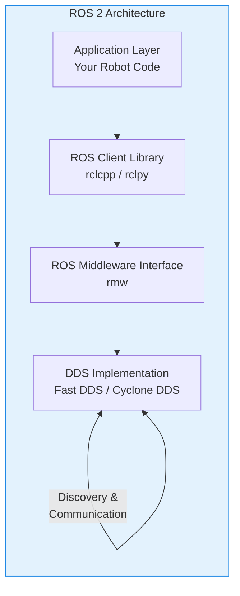
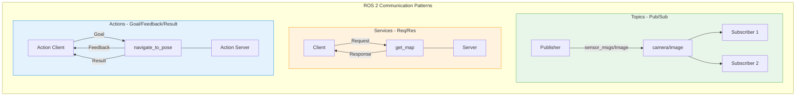

# Week 3: ROS 2 Introduction

## Learning Objectives

After completing this chapter, you will be able to:
- Understand what ROS 2 is and why it's essential for robotics development
- Explain the key differences between ROS 1 and ROS 2
- Describe the ROS 2 architecture and its core components
- Install ROS 2 Humble on Ubuntu Linux
- Execute basic ROS 2 commands and explore the ecosystem
- Set up a ROS 2 workspace for development

---

## 1. What is ROS 2?

**ROS 2** (Robot Operating System 2) is an open-source middleware framework for building robotic applications. Despite its name, ROS is not an operating system—it's a collection of software libraries, tools, and conventions that simplify the development of complex robot behaviors.

### Why ROS 2 Exists

Building a robot requires integrating many components: sensors, actuators, perception algorithms, planning systems, and control loops. Without a framework, developers must write custom code for:
- Inter-process communication between modules
- Hardware abstraction for different sensors/actuators
- Simulation and visualization tools
- Logging, debugging, and introspection

ROS 2 provides all of this out of the box, letting developers focus on their robot's unique capabilities rather than reinventing infrastructure.

### The Evolution from ROS 1

ROS 1 was created at Willow Garage in 2007 and became the de facto standard for robotics research. However, it had limitations:

| Limitation | ROS 1 | ROS 2 Solution |
|------------|-------|----------------|
| **Single point of failure** | Required roscore master | Decentralized (no master) |
| **Real-time support** | No real-time guarantees | Real-time capable via DDS |
| **Security** | No built-in security | DDS security features |
| **Platform support** | Linux only (primarily) | Linux, Windows, macOS |
| **Embedded systems** | Not designed for embedded | Supports microcontrollers |
| **Multi-robot** | Complex configuration | Native multi-robot support |
| **Quality of Service** | Best-effort only | Configurable QoS policies |

ROS 2 was rebuilt from the ground up to address these limitations, making it suitable for production, safety-critical, and commercial robotics applications.

### Key Features of ROS 2

1. **DDS Communication**: Uses Data Distribution Service (DDS) as the middleware layer, providing reliable, real-time communication
2. **No Single Point of Failure**: Fully distributed architecture without a central master
3. **Cross-Platform**: Runs on Linux, Windows, and macOS
4. **Real-Time Support**: Designed for deterministic, low-latency applications
5. **Security**: Built-in authentication, encryption, and access control
6. **Lifecycle Management**: Nodes can be configured, activated, and deactivated programmatically
7. **Quality of Service**: Fine-grained control over communication reliability and latency


*Figure 3.1: ROS 2 architecture layers - from application code to DDS communication*

---

## 2. ROS 2 Architecture

Understanding ROS 2's architecture is essential for building effective robotic systems. The framework is organized into layers, each providing specific functionality.

### The Communication Layer: DDS

At the heart of ROS 2 is **DDS (Data Distribution Service)**, an industry-standard middleware for real-time systems. DDS provides:

- **Publish-Subscribe Messaging**: Nodes publish data to topics; subscribers receive it
- **Service-Oriented Architecture**: Request-response communication patterns
- **Quality of Service (QoS)**: Policies for reliability, durability, deadline, and liveliness
- **Discovery**: Automatic discovery of nodes and topics without central broker
- **Security**: Optional encryption and authentication

ROS 2 supports multiple DDS implementations:
- **Fast DDS** (default): High-performance, open-source implementation by eProsima
- **Cyclone DDS**: Eclipse Foundation's implementation, known for low latency
- **RTI Connext**: Commercial implementation with extensive features

### ROS Client Libraries (RCL)

The **ROS Client Library** provides the API that developers use to build ROS 2 applications:

- **rclcpp**: C++ client library (high performance)
- **rclpy**: Python client library (ease of development)
- **rclnodejs**: Node.js client library
- **rcljava**: Java client library

These libraries provide consistent APIs across languages for:
- Creating nodes
- Publishing and subscribing to topics
- Providing and calling services
- Using actions for long-running tasks
- Managing parameters
- Lifecycle management

### Core Concepts

**Nodes**: The fundamental building blocks of ROS 2 applications. Each node is a process that performs a specific task (e.g., camera driver, path planner, motor controller).

**Topics**: Named channels for publish-subscribe communication. Publishers send messages to topics; subscribers receive them. Topics are typed—each topic carries a specific message type.

**Services**: Synchronous request-response communication. A client sends a request; a server processes it and returns a response.

**Actions**: Asynchronous goal-oriented communication. Used for long-running tasks like navigation. Provides goal, feedback, and result.

**Parameters**: Configuration values that can be set and retrieved at runtime. Allows dynamic reconfiguration without restarting nodes.


*Figure 3.2: ROS 2 communication patterns - Topics, Services, and Actions*

### The Computation Graph

The **computation graph** is the network of ROS 2 nodes connected by topics, services, and actions. At runtime, the graph represents how data flows through your robotic system.

Key characteristics:
- **Dynamic**: Nodes can join and leave at any time
- **Distributed**: Nodes can run on different machines
- **Inspectable**: Tools like `ros2 node`, `ros2 topic`, and `rqt_graph` visualize the graph

---

## 3. ROS 2 Distributions

ROS 2 releases are called **distributions** (distros). Each distribution is a versioned set of ROS 2 packages that are tested to work together.

### Current Distributions

| Distribution | Release Date | EOL | Ubuntu Version | Status |
|-------------|--------------|-----|----------------|--------|
| **Jazzy Jalisco** | May 2024 | May 2029 | Ubuntu 24.04 | Latest LTS |
| **Iron Irwini** | May 2023 | Nov 2024 | Ubuntu 22.04 | Stable |
| **Humble Hawksbill** | May 2022 | May 2027 | Ubuntu 22.04 | **Recommended LTS** |
| **Galactic Geochelone** | May 2021 | Nov 2022 | Ubuntu 20.04 | EOL |
| **Foxy Fitzroy** | June 2020 | May 2023 | Ubuntu 20.04 | EOL |

### Choosing a Distribution

For this course, we recommend **ROS 2 Humble Hawksbill** because:
- Long-term support until May 2027
- Mature ecosystem with extensive package support
- Wide industry adoption
- Compatible with Ubuntu 22.04 LTS
- Excellent documentation and community support

---

## 4. Installing ROS 2 Humble

This section guides you through installing ROS 2 Humble on Ubuntu 22.04 LTS.

### Prerequisites

- Ubuntu 22.04 LTS (Jammy Jellyfish)
- At least 4GB RAM (8GB recommended)
- 20GB free disk space
- Internet connection

### Step 1: Set Up Sources

First, ensure your system is up to date and add the ROS 2 repository:

```bash
# Update system packages
sudo apt update && sudo apt upgrade -y

# Install required tools
sudo apt install -y software-properties-common curl

# Add the ROS 2 GPG key
sudo curl -sSL https://raw.githubusercontent.com/ros/rosdistro/master/ros.key -o /usr/share/keyrings/ros-archive-keyring.gpg

# Add the ROS 2 repository
echo "deb [arch=$(dpkg --print-architecture) signed-by=/usr/share/keyrings/ros-archive-keyring.gpg] http://packages.ros.org/ros2/ubuntu $(. /etc/os-release && echo $UBUNTU_CODENAME) main" | sudo tee /etc/apt/sources.list.d/ros2.list > /dev/null
```

### Step 2: Install ROS 2 Humble

```bash
# Update package index
sudo apt update

# Install ROS 2 Humble Desktop (recommended - includes GUI tools)
sudo apt install -y ros-humble-desktop

# Or install ROS 2 Humble Base (minimal, no GUI)
# sudo apt install -y ros-humble-ros-base
```

The desktop installation includes:
- Core ROS 2 libraries and tools
- RViz2 (3D visualization)
- rqt (GUI tools)
- Demo nodes and tutorials

### Step 3: Environment Setup

ROS 2 requires environment variables to be set. Add this to your `~/.bashrc`:

```bash
# Add ROS 2 Humble to your shell
echo "source /opt/ros/humble/setup.bash" >> ~/.bashrc

# Apply changes to current terminal
source ~/.bashrc
```

### Step 4: Install Development Tools

For development, install additional tools:

```bash
# Install colcon build tool
sudo apt install -y python3-colcon-common-extensions

# Install rosdep for dependency management
sudo apt install -y python3-rosdep

# Initialize rosdep (only once)
sudo rosdep init
rosdep update
```

### Step 5: Verify Installation

Test your installation:

```bash
# Check ROS 2 version
ros2 --version

# Run the talker demo
ros2 run demo_nodes_cpp talker

# In another terminal, run the listener
ros2 run demo_nodes_cpp listener
```

If you see the talker publishing "Hello World" messages and the listener receiving them, your installation is successful!

---

## 5. Basic ROS 2 Commands

ROS 2 provides a powerful command-line interface (CLI) for interacting with the system.

### Node Commands

```bash
# List all running nodes
ros2 node list

# Get info about a specific node
ros2 node info /talker

# Show node's publishers, subscribers, services, and actions
ros2 node info /my_robot_node
```

### Topic Commands

```bash
# List all active topics
ros2 topic list

# Show topic type
ros2 topic info /chatter

# Echo messages on a topic (live stream)
ros2 topic echo /chatter

# Publish a message to a topic
ros2 topic pub /chatter std_msgs/msg/String "data: 'Hello from CLI'"

# Show publishing rate
ros2 topic hz /chatter

# Show message bandwidth
ros2 topic bw /chatter
```

### Service Commands

```bash
# List all services
ros2 service list

# Show service type
ros2 service type /spawn

# Call a service
ros2 service call /spawn turtlesim/srv/Spawn "{x: 2, y: 2, theta: 0.0, name: 'turtle2'}"
```

### Parameter Commands

```bash
# List all parameters for a node
ros2 param list /turtlesim

# Get a parameter value
ros2 param get /turtlesim background_r

# Set a parameter value
ros2 param set /turtlesim background_r 255
```

### Interface Commands

```bash
# List all message types
ros2 interface list

# Show message definition
ros2 interface show std_msgs/msg/String

# Show service definition
ros2 interface show turtlesim/srv/Spawn
```

### Run and Launch Commands

```bash
# Run a single node
ros2 run <package_name> <executable_name>

# Example: Run turtlesim
ros2 run turtlesim turtlesim_node

# Launch multiple nodes with a launch file
ros2 launch <package_name> <launch_file.py>
```

---

## 6. Setting Up a ROS 2 Workspace

A **workspace** is a directory where you develop and build ROS 2 packages.

### Creating a Workspace

```bash
# Create workspace directory
mkdir -p ~/ros2_ws/src

# Navigate to workspace
cd ~/ros2_ws

# Build the workspace (even if empty, this sets up the structure)
colcon build

# Source the workspace
source install/setup.bash
```

### Workspace Structure

After building, your workspace will have this structure:

```
ros2_ws/
├── src/           # Source code (your packages go here)
├── build/         # Build artifacts (generated)
├── install/       # Installed packages (generated)
└── log/           # Build logs (generated)
```

### Creating a Package

ROS 2 packages can be created with `ros2 pkg create`:

```bash
# Navigate to src directory
cd ~/ros2_ws/src

# Create a Python package
ros2 pkg create --build-type ament_python my_py_package

# Create a C++ package
ros2 pkg create --build-type ament_cmake my_cpp_package

# Create a package with dependencies
ros2 pkg create --build-type ament_python my_robot \
    --dependencies rclpy std_msgs sensor_msgs
```

### Building Packages

Use `colcon` to build your workspace:

```bash
# Navigate to workspace root
cd ~/ros2_ws

# Build all packages
colcon build

# Build a specific package
colcon build --packages-select my_package

# Build with symlinks (for Python - faster iteration)
colcon build --symlink-install

# Source the workspace after building
source install/setup.bash
```

### Workspace Overlay

ROS 2 uses an **overlay** system where your workspace extends the base ROS 2 installation:

```bash
# First, source the base ROS 2 installation (underlay)
source /opt/ros/humble/setup.bash

# Then, source your workspace (overlay)
source ~/ros2_ws/install/setup.bash
```

Packages in your workspace can override packages from the base installation, allowing you to modify and test changes without affecting the system installation.

---

## 7. ROS 2 Ecosystem and Tools

ROS 2 comes with a rich ecosystem of tools and packages.

### Visualization: RViz2

**RViz2** is a 3D visualization tool for displaying sensor data, robot models, and navigation information:

```bash
# Launch RViz2
ros2 run rviz2 rviz2

# Or simply
rviz2
```

RViz2 can display:
- Point clouds from LIDAR
- Images from cameras
- Robot models (URDF)
- TF transforms
- Navigation paths and costmaps
- Markers and interactive markers

### GUI Tools: rqt

**rqt** is a Qt-based framework for GUI tools:

```bash
# Launch rqt
rqt

# Specific plugins:
rqt_graph         # Visualize computation graph
rqt_console       # View log messages
rqt_plot          # Plot numeric values
rqt_image_view    # View camera images
rqt_tf_tree       # Visualize TF tree
```

### Simulation: Gazebo

**Gazebo** is a powerful 3D robotics simulator that integrates with ROS 2:

```bash
# Install Gazebo for ROS 2 Humble
sudo apt install ros-humble-gazebo-ros-pkgs

# Launch Gazebo with ROS 2 integration
ros2 launch gazebo_ros gazebo.launch.py
```

### Navigation: Nav2

**Nav2** is the navigation stack for ROS 2, providing:
- Path planning
- Obstacle avoidance
- Localization
- Behavior trees

### Manipulation: MoveIt2

**MoveIt2** is the motion planning framework for robot arms:
- Inverse kinematics
- Motion planning
- Collision detection
- Grasp planning

---

## Summary

This week, we introduced ROS 2—the essential middleware for modern robotics development. Key takeaways:

1. **ROS 2 is middleware, not an OS**: It provides communication, tools, and libraries for building robots
2. **Built on DDS**: Uses industry-standard Data Distribution Service for reliable, real-time communication
3. **Decentralized architecture**: No single point of failure; nodes discover each other automatically
4. **Core concepts**: Nodes, Topics (pub/sub), Services (request/response), Actions (goal-oriented)
5. **Development workflow**: Create workspace → Create packages → Build with colcon → Run nodes
6. **Rich ecosystem**: RViz2, rqt, Gazebo, Nav2, MoveIt2 and thousands of community packages

In Week 4, we'll dive deeper into nodes, topics, and services—writing our first ROS 2 programs in Python and C++.

---

## Further Reading

1. **ROS 2 Official Documentation** - Comprehensive guides and tutorials
   [https://docs.ros.org/en/humble/](https://docs.ros.org/en/humble/)

2. **ROS 2 Design** - Architecture decisions and rationale
   [https://design.ros2.org/](https://design.ros2.org/)

3. **DDS Foundation** - Understanding the underlying communication standard
   [https://www.dds-foundation.org/](https://www.dds-foundation.org/)

4. **The Robotics Back-End** - Practical ROS 2 tutorials
   [https://roboticsbackend.com/category/ros2/](https://roboticsbackend.com/category/ros2/)

5. **ROS Index** - Package directory for ROS 2
   [https://index.ros.org/](https://index.ros.org/)
