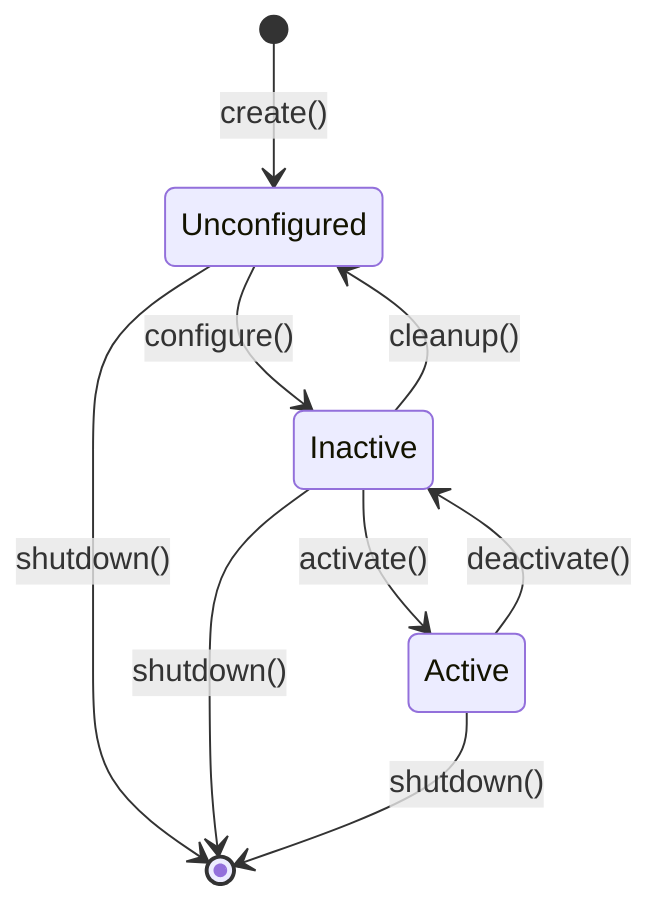

# Week 4: Nodes, Topics, and Services

## Learning Objectives

After completing this chapter, you will be able to:
- Create ROS 2 nodes in Python and understand their lifecycle
- Implement publishers and subscribers for topic-based communication
- Create service servers and clients for request-response patterns
- Understand Quality of Service (QoS) settings and when to use them
- Write launch files to start multiple nodes together
- Debug ROS 2 applications using CLI tools

---

## 1. Understanding ROS 2 Nodes

A **node** is the fundamental unit of computation in ROS 2. Each node is a process that performs a specific task—reading sensors, controlling motors, planning paths, or processing data.

### Node Design Philosophy

Good ROS 2 design follows the **single responsibility principle**: each node should do one thing well. This enables:

- **Modularity**: Replace or upgrade individual components without affecting others
- **Reusability**: Use the same node across different robots
- **Testability**: Test nodes in isolation
- **Fault isolation**: One crashing node doesn't bring down the entire system
- **Distributed computing**: Run nodes on different machines

### Node Lifecycle

ROS 2 nodes can be **managed** or **unmanaged**:

**Unmanaged nodes** (simple):
- Start running immediately when launched
- No explicit state transitions
- Suitable for most applications

**Managed nodes** (lifecycle nodes):
- Explicit states: Unconfigured → Inactive → Active → Finalized
- Allows coordinated startup/shutdown
- Important for safety-critical systems


*Figure 4.1: ROS 2 managed node lifecycle states*

---

## 2. Creating Your First Node in Python

Let's create a simple ROS 2 node using Python (rclpy).

### Basic Node Structure

```python
#!/usr/bin/env python3
import rclpy
from rclpy.node import Node

class MyFirstNode(Node):
    def __init__(self):
        # Initialize the node with a name
        super().__init__('my_first_node')

        # Log a message
        self.get_logger().info('Hello from my first ROS 2 node!')

        # Create a timer that calls a callback every 1 second
        self.timer = self.create_timer(1.0, self.timer_callback)
        self.counter = 0

    def timer_callback(self):
        self.counter += 1
        self.get_logger().info(f'Timer callback #{self.counter}')

def main(args=None):
    # Initialize the ROS 2 Python client library
    rclpy.init(args=args)

    # Create an instance of our node
    node = MyFirstNode()

    # Spin the node so callbacks are called
    rclpy.spin(node)

    # Clean up and shutdown
    node.destroy_node()
    rclpy.shutdown()

if __name__ == '__main__':
    main()
```

### Key Components Explained

1. **`rclpy.init()`**: Initializes the ROS 2 client library. Must be called before creating nodes.

2. **`Node` class**: Base class for all ROS 2 Python nodes. Provides logging, timers, publishers, subscribers, etc.

3. **`super().__init__('node_name')`**: Calls parent constructor with the node's name. This name appears in `ros2 node list`.

4. **`self.get_logger()`**: Returns a logger for this node. Supports `debug()`, `info()`, `warn()`, `error()`, `fatal()`.

5. **`self.create_timer(period, callback)`**: Creates a timer that calls the callback function periodically.

6. **`rclpy.spin(node)`**: Keeps the node alive, processing callbacks. Blocks until shutdown.

7. **`rclpy.shutdown()`**: Cleans up ROS 2 resources.

### Package Setup for Python Nodes

To run this node, you need a proper ROS 2 package structure:

```
my_robot_pkg/
├── package.xml
├── setup.py
├── setup.cfg
├── resource/
│   └── my_robot_pkg
└── my_robot_pkg/
    ├── __init__.py
    └── my_first_node.py
```

**package.xml** (dependencies):
```xml
<?xml version="1.0"?>
<package format="3">
  <name>my_robot_pkg</name>
  <version>0.0.1</version>
  <description>My first ROS 2 package</description>
  <maintainer email="you@email.com">Your Name</maintainer>
  <license>Apache-2.0</license>

  <depend>rclpy</depend>
  <depend>std_msgs</depend>

  <export>
    <build_type>ament_python</build_type>
  </export>
</package>
```

**setup.py** (entry points):
```python
from setuptools import setup

package_name = 'my_robot_pkg'

setup(
    name=package_name,
    version='0.0.1',
    packages=[package_name],
    install_requires=['setuptools'],
    entry_points={
        'console_scripts': [
            'my_first_node = my_robot_pkg.my_first_node:main',
        ],
    },
)
```

---

## 3. Publishers and Subscribers

Topics enable **publish-subscribe** communication—the most common pattern in ROS 2.

### Publishing Messages

A **publisher** sends messages to a topic. Any number of subscribers can receive these messages.

```python
#!/usr/bin/env python3
import rclpy
from rclpy.node import Node
from std_msgs.msg import String

class SimplePublisher(Node):
    def __init__(self):
        super().__init__('simple_publisher')

        # Create a publisher
        # Arguments: message type, topic name, queue size
        self.publisher = self.create_publisher(String, 'chatter', 10)

        # Create a timer to publish periodically
        self.timer = self.create_timer(0.5, self.publish_message)
        self.count = 0

    def publish_message(self):
        msg = String()
        msg.data = f'Hello, ROS 2! Message #{self.count}'

        self.publisher.publish(msg)
        self.get_logger().info(f'Published: "{msg.data}"')
        self.count += 1

def main(args=None):
    rclpy.init(args=args)
    node = SimplePublisher()
    rclpy.spin(node)
    node.destroy_node()
    rclpy.shutdown()

if __name__ == '__main__':
    main()
```

### Subscribing to Messages

A **subscriber** receives messages from a topic.

```python
#!/usr/bin/env python3
import rclpy
from rclpy.node import Node
from std_msgs.msg import String

class SimpleSubscriber(Node):
    def __init__(self):
        super().__init__('simple_subscriber')

        # Create a subscription
        # Arguments: message type, topic name, callback, queue size
        self.subscription = self.create_subscription(
            String,
            'chatter',
            self.message_callback,
            10
        )

    def message_callback(self, msg):
        self.get_logger().info(f'Received: "{msg.data}"')

def main(args=None):
    rclpy.init(args=args)
    node = SimpleSubscriber()
    rclpy.spin(node)
    node.destroy_node()
    rclpy.shutdown()

if __name__ == '__main__':
    main()
```

### Common Message Types

ROS 2 provides standard message types in several packages:

**std_msgs** (basic types):
- `String`, `Int32`, `Float64`, `Bool`, `Header`

**geometry_msgs** (geometry):
- `Point`, `Pose`, `Twist`, `Vector3`, `Transform`

**sensor_msgs** (sensor data):
- `Image`, `LaserScan`, `PointCloud2`, `Imu`, `JointState`

**nav_msgs** (navigation):
- `Odometry`, `Path`, `OccupancyGrid`, `MapMetaData`

```mermaid
flowchart LR
    subgraph Publishers
        P1[Camera Node]
        P2[LIDAR Node]
        P3[IMU Node]
    end

    subgraph Topics
        T1[/camera/image]
        T2[/scan]
        T3[/imu/data]
    end

    subgraph Subscribers
        S1[Perception Node]
        S2[SLAM Node]
        S3[Control Node]
    end

    P1 -->|sensor_msgs/Image| T1
    P2 -->|sensor_msgs/LaserScan| T2
    P3 -->|sensor_msgs/Imu| T3

    T1 --> S1
    T1 --> S2
    T2 --> S1
    T2 --> S2
    T3 --> S2
    T3 --> S3

    style Publishers fill:#e8f5e9,stroke:#4caf50
    style Topics fill:#fff3e0,stroke:#ff9800
    style Subscribers fill:#e3f2fd,stroke:#1e88e5
```
*Figure 4.2: Multiple publishers and subscribers connected through topics*

---

## 4. Services: Request-Response Communication

While topics are for streaming data, **services** are for request-response interactions.

### When to Use Services

- Getting a single piece of information (e.g., "What is the current map?")
- Triggering an action that completes quickly (e.g., "Take a photo")
- Configuration changes (e.g., "Set parameter X to Y")

### Service Definition

Services are defined in `.srv` files with request and response sections:

```
# Example: AddTwoInts.srv
int64 a
int64 b
---
int64 sum
```

### Creating a Service Server

```python
#!/usr/bin/env python3
import rclpy
from rclpy.node import Node
from example_interfaces.srv import AddTwoInts

class AddTwoIntsServer(Node):
    def __init__(self):
        super().__init__('add_two_ints_server')

        # Create a service
        self.service = self.create_service(
            AddTwoInts,           # Service type
            'add_two_ints',       # Service name
            self.handle_request   # Callback function
        )

        self.get_logger().info('Add Two Ints Service is ready.')

    def handle_request(self, request, response):
        response.sum = request.a + request.b
        self.get_logger().info(f'Request: {request.a} + {request.b} = {response.sum}')
        return response

def main(args=None):
    rclpy.init(args=args)
    node = AddTwoIntsServer()
    rclpy.spin(node)
    node.destroy_node()
    rclpy.shutdown()

if __name__ == '__main__':
    main()
```

### Creating a Service Client

```python
#!/usr/bin/env python3
import rclpy
from rclpy.node import Node
from example_interfaces.srv import AddTwoInts

class AddTwoIntsClient(Node):
    def __init__(self):
        super().__init__('add_two_ints_client')

        # Create a client
        self.client = self.create_client(AddTwoInts, 'add_two_ints')

        # Wait for service to be available
        while not self.client.wait_for_service(timeout_sec=1.0):
            self.get_logger().info('Waiting for service...')

    def send_request(self, a, b):
        request = AddTwoInts.Request()
        request.a = a
        request.b = b

        # Call service asynchronously
        future = self.client.call_async(request)
        return future

def main(args=None):
    rclpy.init(args=args)
    client = AddTwoIntsClient()

    # Send request
    future = client.send_request(5, 3)

    # Wait for response
    rclpy.spin_until_future_complete(client, future)

    result = future.result()
    client.get_logger().info(f'Result: {result.sum}')

    client.destroy_node()
    rclpy.shutdown()

if __name__ == '__main__':
    main()
```

---

## 5. Quality of Service (QoS)

QoS settings control how messages are delivered between publishers and subscribers.

### QoS Policies

| Policy | Options | Description |
|--------|---------|-------------|
| **Reliability** | `RELIABLE`, `BEST_EFFORT` | Guaranteed delivery vs. fire-and-forget |
| **Durability** | `VOLATILE`, `TRANSIENT_LOCAL` | Whether to store messages for late joiners |
| **History** | `KEEP_LAST`, `KEEP_ALL` | How many messages to store |
| **Depth** | Integer | Queue size for KEEP_LAST |
| **Deadline** | Duration | Maximum time between messages |
| **Lifespan** | Duration | How long messages are valid |
| **Liveliness** | `AUTOMATIC`, `MANUAL` | How to detect if publisher is alive |

### Common QoS Profiles

```python
from rclpy.qos import QoSProfile, ReliabilityPolicy, HistoryPolicy, DurabilityPolicy

# Sensor data profile (high frequency, best effort)
sensor_qos = QoSProfile(
    reliability=ReliabilityPolicy.BEST_EFFORT,
    history=HistoryPolicy.KEEP_LAST,
    depth=5
)

# Reliable profile (guaranteed delivery)
reliable_qos = QoSProfile(
    reliability=ReliabilityPolicy.RELIABLE,
    history=HistoryPolicy.KEEP_LAST,
    depth=10
)

# Transient local (late joiners get last message)
transient_qos = QoSProfile(
    reliability=ReliabilityPolicy.RELIABLE,
    durability=DurabilityPolicy.TRANSIENT_LOCAL,
    history=HistoryPolicy.KEEP_LAST,
    depth=1
)
```

### Using QoS in Publishers/Subscribers

```python
from rclpy.qos import qos_profile_sensor_data

# Publisher with sensor QoS
self.publisher = self.create_publisher(
    LaserScan,
    '/scan',
    qos_profile_sensor_data
)

# Subscriber with matching QoS
self.subscription = self.create_subscription(
    LaserScan,
    '/scan',
    self.scan_callback,
    qos_profile_sensor_data
)
```

### QoS Compatibility

Publishers and subscribers must have **compatible** QoS settings:
- A `RELIABLE` subscriber can receive from `RELIABLE` publisher only
- A `BEST_EFFORT` subscriber can receive from both
- Mismatched QoS results in no communication (silent failure!)

---

## 6. Launch Files

Launch files start multiple nodes with a single command.

### Python Launch File

```python
# launch/robot_launch.py
from launch import LaunchDescription
from launch_ros.actions import Node

def generate_launch_description():
    return LaunchDescription([
        Node(
            package='my_robot_pkg',
            executable='simple_publisher',
            name='publisher_node',
            output='screen',
            parameters=[{'publish_rate': 10.0}]
        ),
        Node(
            package='my_robot_pkg',
            executable='simple_subscriber',
            name='subscriber_node',
            output='screen'
        ),
    ])
```

### Running Launch Files

```bash
# Run a launch file
ros2 launch my_robot_pkg robot_launch.py

# With arguments
ros2 launch my_robot_pkg robot_launch.py use_sim:=true
```

### Launch File Features

Launch files support:
- **Parameters**: Pass configuration to nodes
- **Remapping**: Change topic/service names
- **Namespaces**: Group nodes under a namespace
- **Conditions**: Launch nodes conditionally
- **Include**: Include other launch files
- **Arguments**: Accept command-line arguments

```python
from launch import LaunchDescription
from launch.actions import DeclareLaunchArgument
from launch.substitutions import LaunchConfiguration
from launch_ros.actions import Node

def generate_launch_description():
    # Declare launch argument
    robot_name_arg = DeclareLaunchArgument(
        'robot_name',
        default_value='my_robot',
        description='Name of the robot'
    )

    return LaunchDescription([
        robot_name_arg,
        Node(
            package='my_robot_pkg',
            executable='robot_controller',
            name='controller',
            namespace=LaunchConfiguration('robot_name'),
            remappings=[
                ('cmd_vel', 'velocity_command'),
            ],
            parameters=[{
                'max_speed': 1.5,
                'robot_name': LaunchConfiguration('robot_name')
            }]
        ),
    ])
```

---

## 7. Debugging ROS 2 Applications

### CLI Debugging Tools

```bash
# List all nodes
ros2 node list

# Get detailed node info
ros2 node info /my_node

# List all topics
ros2 topic list -t  # -t shows types

# Echo topic data
ros2 topic echo /chatter

# Check topic frequency
ros2 topic hz /camera/image

# List services
ros2 service list

# Call a service from CLI
ros2 service call /add_two_ints example_interfaces/srv/AddTwoInts "{a: 5, b: 3}"

# List parameters
ros2 param list /my_node

# Get/set parameters
ros2 param get /my_node max_speed
ros2 param set /my_node max_speed 2.0
```

### Visualization Tools

```bash
# Visualize computation graph
ros2 run rqt_graph rqt_graph

# View logs
ros2 run rqt_console rqt_console

# Plot numeric data
ros2 run rqt_plot rqt_plot /topic/field
```

### Logging Levels

```python
# In your node
self.get_logger().debug('Debug message')   # Detailed debugging
self.get_logger().info('Info message')      # Normal operation
self.get_logger().warn('Warning message')   # Something unexpected
self.get_logger().error('Error message')    # Error occurred
self.get_logger().fatal('Fatal message')    # Critical failure
```

Set logging level at runtime:
```bash
ros2 run my_pkg my_node --ros-args --log-level debug
```

---

## 8. Practical Exercise: Sensor Processing Pipeline

Let's build a complete example: a node that subscribes to sensor data, processes it, and publishes results.

```python
#!/usr/bin/env python3
"""
Sensor Processing Node
Subscribes to laser scan data, processes it, and publishes obstacle alerts.
"""
import rclpy
from rclpy.node import Node
from rclpy.qos import qos_profile_sensor_data
from sensor_msgs.msg import LaserScan
from std_msgs.msg import Bool, Float32

class SensorProcessor(Node):
    def __init__(self):
        super().__init__('sensor_processor')

        # Parameters
        self.declare_parameter('obstacle_threshold', 0.5)
        self.threshold = self.get_parameter('obstacle_threshold').value

        # Subscriber for laser scan
        self.scan_sub = self.create_subscription(
            LaserScan,
            '/scan',
            self.scan_callback,
            qos_profile_sensor_data
        )

        # Publishers
        self.obstacle_pub = self.create_publisher(Bool, '/obstacle_detected', 10)
        self.min_distance_pub = self.create_publisher(Float32, '/min_distance', 10)

        self.get_logger().info(f'Sensor processor started. Threshold: {self.threshold}m')

    def scan_callback(self, msg: LaserScan):
        # Filter out invalid readings (inf, nan)
        valid_ranges = [r for r in msg.ranges
                       if r > msg.range_min and r < msg.range_max]

        if not valid_ranges:
            return

        # Find minimum distance
        min_distance = min(valid_ranges)

        # Publish minimum distance
        dist_msg = Float32()
        dist_msg.data = min_distance
        self.min_distance_pub.publish(dist_msg)

        # Check for obstacle
        obstacle_detected = min_distance < self.threshold

        # Publish obstacle alert
        alert_msg = Bool()
        alert_msg.data = obstacle_detected
        self.obstacle_pub.publish(alert_msg)

        if obstacle_detected:
            self.get_logger().warn(f'Obstacle detected at {min_distance:.2f}m!')

def main(args=None):
    rclpy.init(args=args)
    node = SensorProcessor()

    try:
        rclpy.spin(node)
    except KeyboardInterrupt:
        pass
    finally:
        node.destroy_node()
        rclpy.shutdown()

if __name__ == '__main__':
    main()
```

---

## Summary

This week, we dove deep into ROS 2 programming fundamentals:

1. **Nodes**: The building blocks of ROS 2 applications; follow single responsibility principle
2. **Topics**: Publish-subscribe communication for streaming data; many-to-many connections
3. **Services**: Request-response communication for synchronous operations
4. **QoS**: Quality of Service settings control reliability, durability, and history
5. **Launch files**: Start multiple nodes with configuration using Python launch files
6. **Debugging**: CLI tools (`ros2 topic`, `ros2 node`, etc.) and GUI tools (rqt_graph, rqt_console)

In Week 5, we'll learn about URDF (Unified Robot Description Format) for describing robot models—essential for simulation and visualization.

---

## Further Reading

1. **ROS 2 Tutorials - Writing Nodes** - Official step-by-step guides
   [https://docs.ros.org/en/humble/Tutorials/Beginner-Client-Libraries.html](https://docs.ros.org/en/humble/Tutorials/Beginner-Client-Libraries.html)

2. **ROS 2 QoS Documentation** - Deep dive into Quality of Service
   [https://docs.ros.org/en/humble/Concepts/About-Quality-of-Service-Settings.html](https://docs.ros.org/en/humble/Concepts/About-Quality-of-Service-Settings.html)

3. **ROS 2 Launch Tutorial** - Creating and using launch files
   [https://docs.ros.org/en/humble/Tutorials/Intermediate/Launch/Launch-Main.html](https://docs.ros.org/en/humble/Tutorials/Intermediate/Launch/Launch-Main.html)

4. **rclpy API Documentation** - Python client library reference
   [https://docs.ros2.org/latest/api/rclpy/](https://docs.ros2.org/latest/api/rclpy/)

5. **std_msgs Package** - Standard message types
   [https://docs.ros.org/en/humble/p/std_msgs/](https://docs.ros.org/en/humble/p/std_msgs/)
