# Week 5: URDF for Humanoids

## Learning Objectives

After completing this chapter, you will be able to:
- Understand URDF structure and XML format for robot description
- Define robot links with visual, collision, and inertial properties
- Create joints to connect links and define motion constraints
- Use Xacro macros to create modular, reusable robot descriptions
- Visualize and debug URDF models in RViz2
- Build a simple humanoid robot model from scratch

---

## 1. What is URDF?

**URDF (Unified Robot Description Format)** is an XML-based format for describing robot models in ROS. It defines the robot's physical structure including:

- **Links**: Rigid bodies (torso, arms, legs, head)
- **Joints**: Connections between links (revolute, prismatic, fixed)
- **Sensors**: Cameras, LIDAR, IMUs attached to links
- **Visual geometry**: How the robot looks (meshes, shapes)
- **Collision geometry**: Simplified shapes for physics simulation
- **Inertial properties**: Mass and inertia for dynamics

### Why URDF Matters

URDF is the foundation for:
- **Visualization**: Display robot in RViz2
- **Simulation**: Physics simulation in Gazebo
- **Motion planning**: MoveIt2 uses URDF for kinematics
- **State publishing**: Track joint positions and transforms
- **Sensor integration**: Define sensor positions and properties

```mermaid
flowchart TB
    subgraph URDF["📄 URDF File"]
        L[Links<br/>Rigid Bodies]
        J[Joints<br/>Connections]
        V[Visual<br/>Appearance]
        C[Collision<br/>Physics]
        I[Inertial<br/>Mass/Inertia]
    end

    subgraph Uses["🔧 Applications"]
        RV[RViz2<br/>Visualization]
        GZ[Gazebo<br/>Simulation]
        MV[MoveIt2<br/>Motion Planning]
        TF[TF2<br/>Transforms]
    end

    URDF --> Uses

    style URDF fill:#e3f2fd,stroke:#1e88e5
    style Uses fill:#e8f5e9,stroke:#4caf50
```


*Figure 5.1: URDF is the foundation for visualization, simulation, and motion planning*

---

## 2. URDF Structure

A URDF file is XML with a specific structure:

```xml
<?xml version="1.0"?>
<robot name="my_robot">
  <!-- Links define rigid bodies -->
  <link name="base_link">
    <!-- Visual: how it looks -->
    <visual>
      <geometry>
        <box size="0.5 0.3 0.1"/>
      </geometry>
      <material name="blue">
        <color rgba="0 0 0.8 1"/>
      </material>
    </visual>

    <!-- Collision: for physics -->
    <collision>
      <geometry>
        <box size="0.5 0.3 0.1"/>
      </geometry>
    </collision>

    <!-- Inertial: mass and inertia -->
    <inertial>
      <mass value="10.0"/>
      <inertia ixx="0.1" ixy="0" ixz="0" iyy="0.1" iyz="0" izz="0.1"/>
    </inertial>
  </link>

  <!-- Joints connect links -->
  <joint name="base_to_arm" type="revolute">
    <parent link="base_link"/>
    <child link="arm_link"/>
    <origin xyz="0.25 0 0.05" rpy="0 0 0"/>
    <axis xyz="0 1 0"/>
    <limit lower="-1.57" upper="1.57" effort="100" velocity="1.0"/>
  </joint>

  <link name="arm_link">
    <!-- ... -->
  </link>
</robot>
```

### Link Elements

**Visual**: Defines appearance for visualization
```xml
<visual>
  <origin xyz="0 0 0" rpy="0 0 0"/>
  <geometry>
    <box size="0.1 0.1 0.5"/>      <!-- Box: x, y, z dimensions -->
    <!-- OR -->
    <cylinder radius="0.05" length="0.3"/>
    <!-- OR -->
    <sphere radius="0.1"/>
    <!-- OR -->
    <mesh filename="package://my_pkg/meshes/arm.stl" scale="1 1 1"/>
  </geometry>
  <material name="red">
    <color rgba="1 0 0 1"/>
  </material>
</visual>
```

**Collision**: Simplified geometry for physics (often simpler than visual)
```xml
<collision>
  <origin xyz="0 0 0" rpy="0 0 0"/>
  <geometry>
    <box size="0.1 0.1 0.5"/>
  </geometry>
</collision>
```

**Inertial**: Mass and inertia tensor for dynamics
```xml
<inertial>
  <origin xyz="0 0 0.25" rpy="0 0 0"/>  <!-- Center of mass -->
  <mass value="2.5"/>
  <inertia ixx="0.01" ixy="0" ixz="0" iyy="0.01" iyz="0" izz="0.005"/>
</inertial>
```

### Joint Types

| Type | Description | DOF | Example |
|------|-------------|-----|---------|
| **revolute** | Rotation around axis with limits | 1 | Elbow, knee |
| **continuous** | Rotation without limits | 1 | Wheel |
| **prismatic** | Linear motion along axis | 1 | Elevator, piston |
| **fixed** | No motion (rigid connection) | 0 | Sensor mount |
| **floating** | 6-DOF free motion | 6 | Mobile base |
| **planar** | Motion in a plane | 3 | 2D robot |

```xml
<!-- Revolute joint (most common for humanoids) -->
<joint name="shoulder_pitch" type="revolute">
  <parent link="torso"/>
  <child link="upper_arm"/>
  <origin xyz="0.15 0.2 0" rpy="0 0 0"/>
  <axis xyz="0 1 0"/>  <!-- Rotation axis -->
  <limit lower="-2.0" upper="2.0" effort="50" velocity="2.0"/>
  <dynamics damping="0.1" friction="0.05"/>
</joint>
```

---

## 3. Building a Simple Humanoid

Let's create a basic humanoid robot with torso, head, and arms:

```xml
<?xml version="1.0"?>
<robot name="simple_humanoid">

  <!-- Base/Torso -->
  <link name="base_link">
    <visual>
      <geometry>
        <box size="0.3 0.4 0.5"/>
      </geometry>
      <material name="gray">
        <color rgba="0.5 0.5 0.5 1"/>
      </material>
    </visual>
    <collision>
      <geometry>
        <box size="0.3 0.4 0.5"/>
      </geometry>
    </collision>
    <inertial>
      <mass value="15.0"/>
      <inertia ixx="0.5" ixy="0" ixz="0" iyy="0.4" iyz="0" izz="0.3"/>
    </inertial>
  </link>

  <!-- Head -->
  <link name="head">
    <visual>
      <geometry>
        <sphere radius="0.12"/>
      </geometry>
      <material name="white">
        <color rgba="0.9 0.9 0.9 1"/>
      </material>
    </visual>
    <collision>
      <geometry>
        <sphere radius="0.12"/>
      </geometry>
    </collision>
    <inertial>
      <mass value="2.0"/>
      <inertia ixx="0.01" ixy="0" ixz="0" iyy="0.01" iyz="0" izz="0.01"/>
    </inertial>
  </link>

  <!-- Neck joint -->
  <joint name="neck_yaw" type="revolute">
    <parent link="base_link"/>
    <child link="head"/>
    <origin xyz="0 0 0.35" rpy="0 0 0"/>
    <axis xyz="0 0 1"/>
    <limit lower="-1.5" upper="1.5" effort="10" velocity="1.0"/>
  </joint>

  <!-- Right Upper Arm -->
  <link name="right_upper_arm">
    <visual>
      <origin xyz="0 0 -0.15"/>
      <geometry>
        <cylinder radius="0.04" length="0.3"/>
      </geometry>
      <material name="blue">
        <color rgba="0.2 0.2 0.8 1"/>
      </material>
    </visual>
    <collision>
      <origin xyz="0 0 -0.15"/>
      <geometry>
        <cylinder radius="0.04" length="0.3"/>
      </geometry>
    </collision>
    <inertial>
      <mass value="1.5"/>
      <inertia ixx="0.01" ixy="0" ixz="0" iyy="0.01" iyz="0" izz="0.005"/>
    </inertial>
  </link>

  <!-- Right shoulder joint -->
  <joint name="right_shoulder_pitch" type="revolute">
    <parent link="base_link"/>
    <child link="right_upper_arm"/>
    <origin xyz="0 -0.25 0.2" rpy="0 0 0"/>
    <axis xyz="0 1 0"/>
    <limit lower="-3.14" upper="1.0" effort="30" velocity="2.0"/>
  </joint>

  <!-- Right Forearm -->
  <link name="right_forearm">
    <visual>
      <origin xyz="0 0 -0.125"/>
      <geometry>
        <cylinder radius="0.035" length="0.25"/>
      </geometry>
      <material name="blue"/>
    </visual>
    <collision>
      <origin xyz="0 0 -0.125"/>
      <geometry>
        <cylinder radius="0.035" length="0.25"/>
      </geometry>
    </collision>
    <inertial>
      <mass value="1.0"/>
      <inertia ixx="0.005" ixy="0" ixz="0" iyy="0.005" iyz="0" izz="0.002"/>
    </inertial>
  </link>

  <!-- Right elbow joint -->
  <joint name="right_elbow" type="revolute">
    <parent link="right_upper_arm"/>
    <child link="right_forearm"/>
    <origin xyz="0 0 -0.3" rpy="0 0 0"/>
    <axis xyz="0 1 0"/>
    <limit lower="0" upper="2.5" effort="20" velocity="2.0"/>
  </joint>

  <!-- Add left arm similarly... -->

</robot>
```

---

## 4. Xacro: Macros for URDF

**Xacro** (XML Macros) makes URDF more maintainable through:
- **Properties**: Variables for reusable values
- **Macros**: Reusable blocks of XML
- **Includes**: Split URDF into multiple files
- **Math expressions**: Calculate values

### Xacro Example

```xml
<?xml version="1.0"?>
<robot xmlns:xacro="http://www.ros.org/wiki/xacro" name="humanoid">

  <!-- Properties (variables) -->
  <xacro:property name="torso_mass" value="15.0"/>
  <xacro:property name="arm_length" value="0.3"/>
  <xacro:property name="arm_radius" value="0.04"/>

  <!-- Macro for arm link -->
  <xacro:macro name="arm_link" params="name length radius mass">
    <link name="${name}">
      <visual>
        <origin xyz="0 0 ${-length/2}"/>
        <geometry>
          <cylinder radius="${radius}" length="${length}"/>
        </geometry>
        <material name="arm_material">
          <color rgba="0.2 0.2 0.8 1"/>
        </material>
      </visual>
      <collision>
        <origin xyz="0 0 ${-length/2}"/>
        <geometry>
          <cylinder radius="${radius}" length="${length}"/>
        </geometry>
      </collision>
      <inertial>
        <mass value="${mass}"/>
        <inertia ixx="${mass*length*length/12}" ixy="0" ixz="0"
                 iyy="${mass*length*length/12}" iyz="0"
                 izz="${mass*radius*radius/2}"/>
      </inertial>
    </link>
  </xacro:macro>

  <!-- Use the macro -->
  <xacro:arm_link name="right_upper_arm" length="${arm_length}" radius="${arm_radius}" mass="1.5"/>
  <xacro:arm_link name="right_forearm" length="0.25" radius="0.035" mass="1.0"/>
  <xacro:arm_link name="left_upper_arm" length="${arm_length}" radius="${arm_radius}" mass="1.5"/>
  <xacro:arm_link name="left_forearm" length="0.25" radius="0.035" mass="1.0"/>

</robot>
```

### Processing Xacro

```bash
# Convert xacro to URDF
xacro model.urdf.xacro > model.urdf

# Or use in launch file
from launch_ros.parameter_descriptions import ParameterValue
from launch.substitutions import Command

robot_description = ParameterValue(
    Command(['xacro ', '/path/to/robot.urdf.xacro']),
    value_type=str
)
```

---

## 5. Visualizing URDF in RViz2

### Robot State Publisher

The **robot_state_publisher** node reads URDF and publishes transforms:

```bash
# Launch robot state publisher
ros2 run robot_state_publisher robot_state_publisher --ros-args -p robot_description:="$(xacro /path/to/robot.urdf.xacro)"
```

### Launch File for Visualization

```python
from launch import LaunchDescription
from launch_ros.actions import Node
from launch.substitutions import Command
from ament_index_python.packages import get_package_share_directory
import os

def generate_launch_description():
    pkg_path = get_package_share_directory('my_robot_description')
    urdf_path = os.path.join(pkg_path, 'urdf', 'robot.urdf.xacro')

    robot_description = Command(['xacro ', urdf_path])

    return LaunchDescription([
        # Robot state publisher
        Node(
            package='robot_state_publisher',
            executable='robot_state_publisher',
            parameters=[{'robot_description': robot_description}]
        ),

        # Joint state publisher GUI (for testing)
        Node(
            package='joint_state_publisher_gui',
            executable='joint_state_publisher_gui'
        ),

        # RViz2
        Node(
            package='rviz2',
            executable='rviz2',
            arguments=['-d', os.path.join(pkg_path, 'rviz', 'display.rviz')]
        ),
    ])
```

### RViz2 Configuration

In RViz2:
1. Add **RobotModel** display
2. Set **Description Topic** to `/robot_description`
3. Set **Fixed Frame** to `base_link`
4. Add **TF** display to see coordinate frames

---

## 6. TF2: Transform System

URDF generates a **TF tree** representing spatial relationships between links.


*Figure 5.2: TF tree for a humanoid robot*

### Querying Transforms

```bash
# View TF tree
ros2 run tf2_tools view_frames

# Echo transform between frames
ros2 run tf2_ros tf2_echo base_link right_hand

# Monitor TF
ros2 run tf2_ros tf2_monitor
```

---

## 7. Common URDF Issues

### Debugging Tools

```bash
# Check URDF syntax
check_urdf robot.urdf

# Visualize URDF structure
urdf_to_graphviz robot.urdf
```

### Common Mistakes

1. **Missing inertial**: Required for Gazebo simulation
2. **Zero inertia**: Causes physics instability
3. **Overlapping collision**: Links colliding at spawn
4. **Wrong joint axis**: Robot moves unexpectedly
5. **Missing mesh files**: Visual/collision geometry not found

### Inertia Calculation

For common shapes:

**Box** (mass m, dimensions x, y, z):
```
ixx = m/12 * (y² + z²)
iyy = m/12 * (x² + z²)
izz = m/12 * (x² + y²)
```

**Cylinder** (mass m, radius r, length h):
```
ixx = iyy = m/12 * (3r² + h²)
izz = m/2 * r²
```

**Sphere** (mass m, radius r):
```
ixx = iyy = izz = 2/5 * m * r²
```

---

## Summary

This week, we learned URDF for robot modeling:

1. **URDF structure**: XML format with links, joints, visual, collision, and inertial elements
2. **Link properties**: Visual appearance, collision geometry, and mass/inertia
3. **Joint types**: Revolute, continuous, prismatic, fixed for different motions
4. **Xacro**: Macros and properties for maintainable robot descriptions
5. **Visualization**: Robot state publisher + RViz2 for viewing models
6. **TF2**: Transform tree generated from URDF joint hierarchy

In Week 6, we'll use our URDF models in Gazebo simulation—bringing our robots to life with physics!

---

## Further Reading

1. **URDF Tutorials** - Official ROS 2 URDF documentation
   [https://docs.ros.org/en/humble/Tutorials/Intermediate/URDF/URDF-Main.html](https://docs.ros.org/en/humble/Tutorials/Intermediate/URDF/URDF-Main.html)

2. **Xacro Documentation** - XML Macros for URDF
   [http://wiki.ros.org/xacro](http://wiki.ros.org/xacro)

3. **TF2 Documentation** - Transform system in ROS 2
   [https://docs.ros.org/en/humble/Concepts/About-Tf2.html](https://docs.ros.org/en/humble/Concepts/About-Tf2.html)

4. **robot_state_publisher** - Publishing robot state from URDF
   [https://github.com/ros/robot_state_publisher](https://github.com/ros/robot_state_publisher)

5. **URDF XML Specification** - Complete URDF reference
   [http://wiki.ros.org/urdf/XML](http://wiki.ros.org/urdf/XML)
